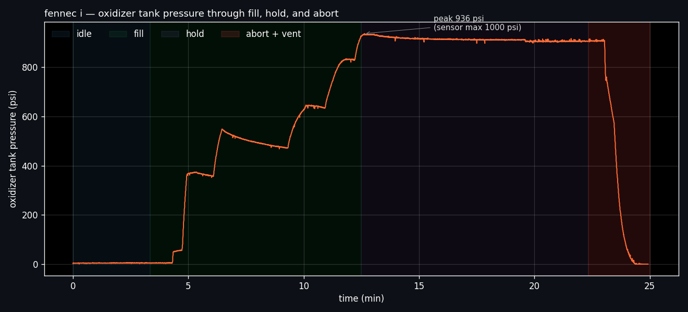
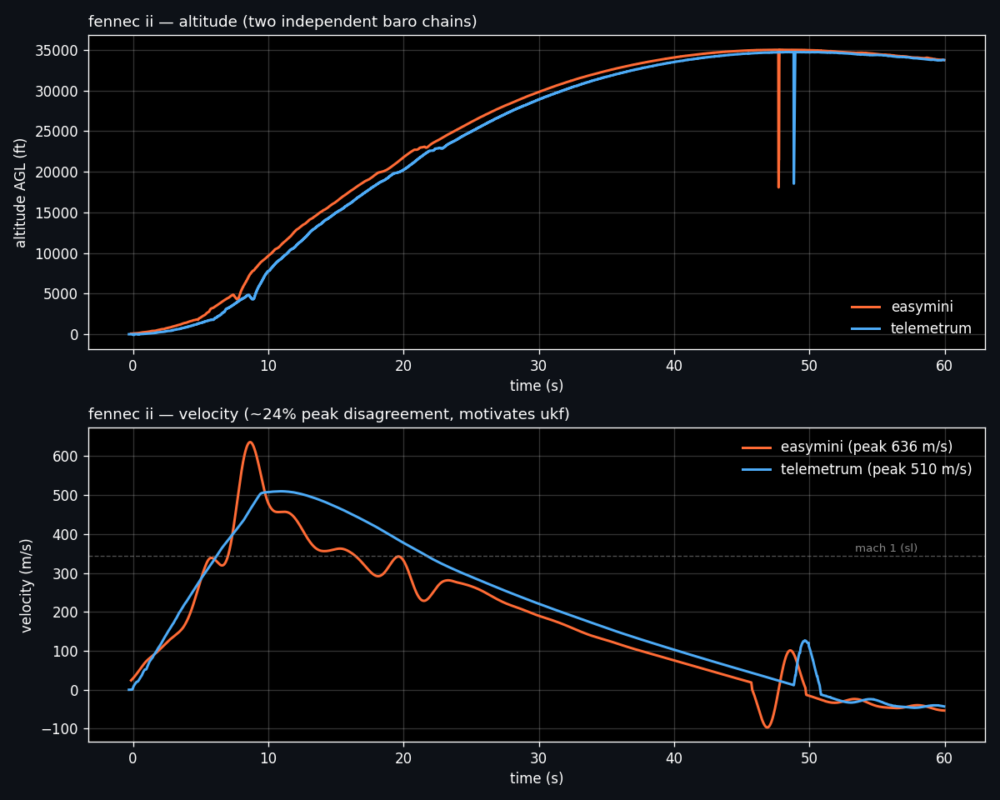

# fennec-mission

two-vehicle hybrid sounding rocket program (goddard, 2024–2025). software and data analysis slice.

## tl;dr

**fennec i** — scrubbed on the pad. onboard payload instrumentation caught an oxidizer-tank pressure anomaly during the fill/hold sequence; abort called; oxidizer vented cleanly. vehicle never left the pad.

**fennec ii** — flew. apogee **35,050 ft agl**, peak velocity between **mach 1.49 and mach 1.85** depending on which altimeter you ask. two independent baro chains disagreed by ~24% in the transonic region — a known artifact of baro-derived velocity through mach 1 — motivating the ukf work currently in progress to reconcile the two boards against payload imu.

live downlink to the raspberry pi ground station did not receive in flight on either mission (suspected frequency interference or transmit power). all data here was recovered from onboard recorders.

## repo

- [`fennec-1/`](fennec-1/) — payload avionics, omega transducer sketch, full pad-session log through the abort.
- [`fennec-2/`](fennec-2/) — altus metrum flight data (telemetrum + easymini), analysis of the altimeter disagreement, planned ukf reconciliation.

## attribution

part of the goddard fennec program. i led the software and data-analysis side — payload firmware, ground station rig, flight-data reduction, and the ukf work in progress. airframe, propulsion, integration, and recovery systems were the rest of the team.
