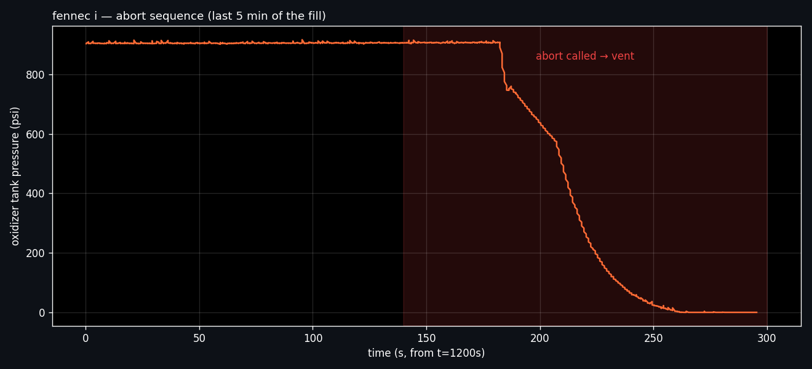
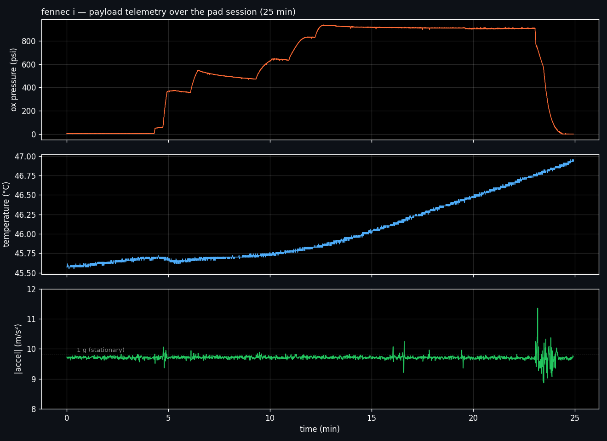

# fennec i — payload avionics + pad abort

fennec i was scrubbed on the pad before launch due to an oxidizer-tank pressure anomaly. the vehicle never left the pad. this data — recovered from the onboard payload avionics — is the full 25-minute pad session: idle, fill, hold, and abort/vent.

the abort was called correctly by the pad procedure; the instrumentation caught what it was designed to catch. fennec ii was built and flown after this scrub.

## what's here

- `omega_transducer.ino` — arduino sketch for the omega px1600 pressure transducer (0.5–4.5v analog, 0–1000 psi range). used on the ox tank for both fennec i and (later) fennec ii. handles adc read at 14-bit resolution, voltage → psi conversion, and a first-order temperature-drift correction (0.05% fs/°c on both zero and span).
- `Payload Data - Sheet1.csv` — full pad session log (4,335 samples at ~2.9 hz over ~25 min). columns: timestamps (day/hour/minute/second/microsecond), baro pressure (hpa), accelerometer (x/y/z), gyroscope (x/y/z), humidity, temperature, oxidizer pressure (psi), voltage, altitude (m).

## the story from the data

**four phases visible in the ox pressure trace:**

1. **idle (~0–3.5 min)** — sensor at ambient, ~4 psi, tank empty.
2. **fill (~3.5–12.5 min)** — stepped fill of the oxidizer tank. each step corresponds to a discrete fill operation; pressure ramps in ~6 discrete increments to ~910 psi.
3. **hold (~12.5–22 min)** — pressure stabilizes at ~910 psi. peak reading 936 psi (close to the transducer's 1000 psi sensing max).
4. **abort + vent (~22–25 min)** — abort called; oxidizer vented from ~910 psi to 0 over ~2 min.

**cross-channel verification** that the vehicle was on the pad the whole time:

total acceleration magnitude sits at ~9.8 m/s² throughout (1 g stationary). baro-derived altitude varies by <5 m across the full 25-minute session — atmospheric noise, not motion. the abort happened *before* ignition; the payload never saw powered flight.

## what this doesn't tell you

this dataset shows *what happened during the pad session*, not *why the abort was called*. the specific abort criterion — whether it was the pressure margin, a fill-system issue, a weather cutoff, or ground-crew judgment on the readings — isn't recoverable from the payload data alone. if you need that, it lives in the mission-day team notes, not this file.

## why publish an aborted mission

catching a pressure anomaly on the pad and safely venting is what pad procedures exist to do. the instrumentation worked. the abort criterion worked. no vehicle loss, no injury. fennec ii — which flew successfully — was designed after and informed by this scrub.
