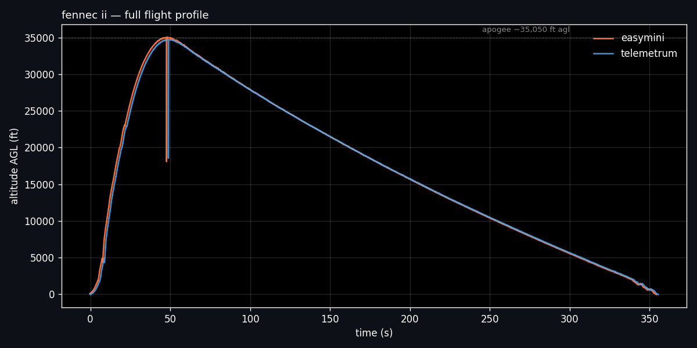
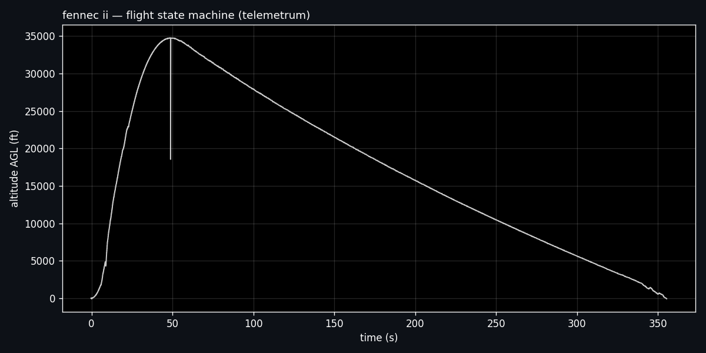
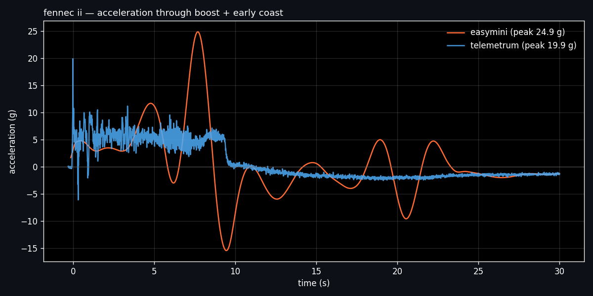
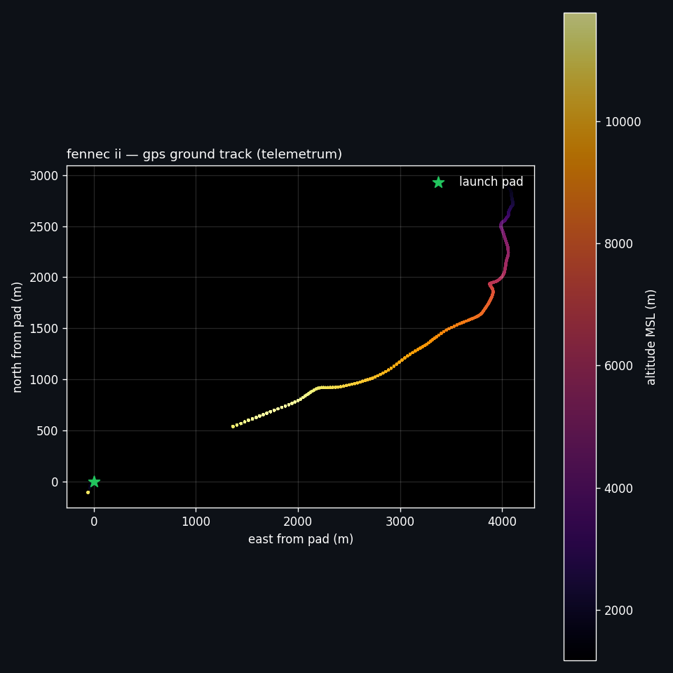

# fennec ii — flight data

fennec ii flew after fennec i was scrubbed on the pad (see `../fennec-1/`). the vehicle recovered from launch through descent to landing; onboard altus metrum recorders captured the full flight. the intended live downlink to the raspberry pi ground station did not receive in flight (suspected frequency interference or insufficient transmit power — a peer team at the same range had identical symptoms). the data here came from the onboard recorders, not the ground station.

## headline numbers

| | telemetrum | easymini |
|---|---|---|
| apogee (ft agl) | 34,755 | **35,050** |
| peak velocity (m/s) | 510 | 636 |
| peak velocity (mach @ sl) | 1.49 | **1.85** |
| peak acceleration (g) | ~20 | ~25 |

**the two altimeters disagree on peak velocity by ~24%.** this isn't sensor noise — it's a real reconciliation problem, and the reason the ukf work in the fennec program exists. see the analysis section below.

## full flight profile

both boards captured ~355 s of data from launch through descent. altitude tracks agree closely across the entire arc.

## flight state machine

telemetrum's onboard flight-state machine transitions: pad → boost → coast → drogue → main → landed. drogue deploys at apogee, main deploys at ~2000 ft AGL for the final descent.

## boost dynamics

peak acceleration during boost — ~25 g on easymini, ~20 g on telemetrum. difference is consistent with the two boards' different accelerometer ranges and integration behavior.

## the altimeter disagreement — motivation for ukf work

the disagreement is not distributed evenly across the flight — it's concentrated in the transonic region around t≈6–10 s. easymini shows a sharp spike; telemetrum shows a smoother lower peak.

this pattern is a **transonic barometric artifact**. baro-only altimeters (like easymini) derive velocity from the numerical derivative of pressure altitude. as the vehicle crosses mach 1, shock effects at the static port cause pressure readings to jump, which the differentiator amplifies into a spurious velocity spike. telemetrum's speed estimate is accelerometer-blended and is less exposed to this artifact.

this is a known failure mode of baro-derived velocity in transonic flight — not something wrong with the easymini specifically.

## ground track

telemetrum's gps captured the full trajectory. rocket drifted ~5 km northeast under drogue/main before landing. plot uses coordinates relative to the pad (absolute lat/lon in the csv is preserved for waiver documentation but stripped from visuals).

## planned work — ukf reconciliation

**in progress, not yet built.** the goal is a single defensible velocity estimate that fuses:

- baro altitude from both altus metrum boards (as position observations)
- imu acceleration from the custom payload (as high-rate dynamics)
- telemetrum's built-in accelerometer-blended speed (as a sanity channel)

target output: posterior velocity with covariance, so the transonic uncertainty is visible in the estimate rather than hidden inside a single-number peak claim.

status: filter design in progress. an `analysis/ukf/` subdirectory will land here when the code is ready to publish.

## files

- `easymini.csv` — altus metrum easymini backup altimeter, 8,181 samples, ~354 s. baro-only.
- `fennec_ii_telemetrum.csv` — altus metrum telemetrum primary altimeter with gps + telemetry radio, 10,835 samples, ~355 s.
- `altimeter_comparison.png` — velocity + altitude side-by-side, transonic disagreement highlighted.
- `full_altitude.png` — full flight altitude for both boards.
- `state_machine.png` — altitude colored by flight state.
- `acceleration.png` — boost + early coast acceleration in g.
- `ground_track.png` — gps ground track relative to pad.

## column reference

altus metrum's own documentation covers the full schema. quick notes on what's used most:

- `time` — seconds from ignition (negative values are pre-launch)
- `state_name` — flight state machine (pad, boost, coast, drogue, main, landed)
- `height` — altitude above pad, meters
- `altitude` — msl altitude, meters
- `speed` — vertical velocity (baro-derived on easymini; baro + accel-integrated on telemetrum), m/s
- `acceleration` — vertical acceleration, m/s²
